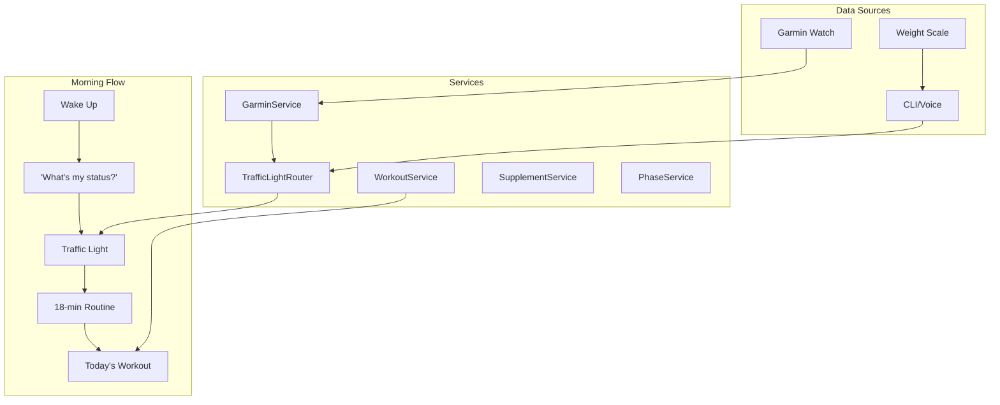

# ATLAS Health Routine System

**Created:** January 15, 2026
**Scope:** Morning routine, workouts, supplements, weight tracking, Garmin integration

---

## Overview

ATLAS provides a voice-first health tracking system focused on daily routine optimization:

```
Wake → Voice Status → Morning Routine → Workout → Supplements → Weight
```

**Core Principle:** Minimal friction, maximum consistency. Data collection should take seconds, not minutes.

---

## Architecture



---

## Daily Flow

### 1. Morning Status (Voice)

```bash
"What's my status?"
→ "YELLOW. Battery 32. HRV 56. Proceed with caution. Active Mobility."

"Morning briefing"
→ "Morning briefing. YELLOW status. Body battery 32, running low.
   HRV 56. Stress moderate at 41. Today: Active Mobility."
```

**0 tokens** - reads from cached Garmin sync.

### 2. Traffic Light System

| Status | Criteria | Action |
|--------|----------|--------|
| GREEN | Sleep ≥6.5h AND HRV BALANCED AND RHR ≤55 | Full intensity |
| YELLOW | Mixed signals or insufficient data | -15% intensity |
| RED | Sleep <5.5h OR HRV LOW/UNBALANCED OR RHR >baseline+5 | Recovery only |

### 3. Morning Routine (18 min)

```bash
python -m atlas.health.cli routine        # Display routine
python -m atlas.health.cli routine start  # Interactive with timers
```

Sections:
1. Feet & plantar fascia (4 min)
2. Ankle mobility (4 min)
3. Lower back & hips (4 min)
4. Shoulder rehab (4 min)
5. Breathing & activation (2 min)

### 4. Today's Workout

```bash
python -m atlas.health.cli workout        # Show today's protocol
python -m atlas.health.cli workout --red  # RED day override
```

Weekly schedule (Phase 1):
| Day | Protocol |
|-----|----------|
| Mon | Strength A |
| Tue | Zone 2 Cardio |
| Wed | Strength B |
| Thu | Active Mobility |
| Fri | Strength C |
| Sat | VO2 Max (optional) |
| Sun | Recovery |

### 5. Supplements

```bash
python -m atlas.health.cli supplements              # Today's checklist
python -m atlas.health.cli supplements all-morning  # Mark all morning taken
python -m atlas.health.cli supplements check "Vitamin D"
```

### 6. Weight Tracking

```bash
python -m atlas.health.cli weight                    # Show recent
python -m atlas.health.cli weight log 82.3           # Log weight only
python -m atlas.health.cli weight log 82.3 --bf 18.5 # With body fat %
python -m atlas.health.cli weight trend              # 7-day trend
```

**Voice:**
```bash
"Log weight 82.3"
"What's my weight trend?"
```

---

## Data Model

### Weight Tracking

```sql
CREATE TABLE IF NOT EXISTS weight_log (
    id INTEGER PRIMARY KEY AUTOINCREMENT,
    date DATE NOT NULL,
    time TIME,
    weight_kg REAL NOT NULL CHECK(weight_kg BETWEEN 20 AND 300),
    body_fat_pct REAL CHECK(body_fat_pct BETWEEN 1 AND 70),
    source VARCHAR(20) DEFAULT 'manual',  -- manual, voice
    notes TEXT,
    created_at TIMESTAMP DEFAULT CURRENT_TIMESTAMP,
    UNIQUE(date, time)
);

CREATE INDEX IF NOT EXISTS idx_weight_log_date ON weight_log(date DESC);
```

### Existing Tables (Summary)

| Table | Purpose |
|-------|---------|
| `pain_log` | Daily pain by body part (0-10) |
| `assessments` | 40+ test results with baselines |
| `phase_history` | Training phase transitions |
| `workouts` | Completed workout logs |
| `supplement_log` | Daily supplement compliance |

---

## Garmin Integration

### Metrics Synced
- Sleep: hours, score, stages (deep/REM/light)
- HRV: status, average, baseline
- Recovery: body battery, stress level
- Heart: resting HR

### Sync Commands
```bash
python -m atlas.health.cli garmin status  # Check connection
python -m atlas.health.cli garmin sync    # Manual sync
```

### Automatic Sync
Morning sync caches status to `~/.atlas/morning_status.json` for 0-token voice queries.

---

## GATE Progression System

Phase advancement requires passing GATE assessments:

| GATE | Phase | Requirements |
|------|-------|--------------|
| 1 | 1→2 | Ankle LSI ≥90%, 60s balance, 25 heel raises |
| 2 | 2→3 | Hop tests LSI ≥90%, 2-mile jog |
| 3 | 3→4 | Hop tests LSI ≥95%, 20-min tempo |
| 4 | Maintain | Sprint progression, RSA ≤10% |

```bash
python -m atlas.health.cli assess gate 1  # Check GATE 1 readiness
python -m atlas.health.cli phase check    # Check phase advancement
```

---

## CLI Command Reference

| Command | Purpose |
|---------|---------|
| `daily` | Morning status with Traffic Light |
| `workout` | View/log workouts |
| `supplements` | Supplement checklist |
| `weight` | Weight tracking |
| `pain` | Pain level logging |
| `routine` | Morning routine |
| `assess` | Fitness assessments |
| `phase` | Training phase management |
| `garmin` | Garmin Connect sync |
| `stats` | Weekly statistics |

---

## Voice Commands

| Say | Action | Tokens |
|-----|--------|--------|
| "my status" | Quick Traffic Light | 0 |
| "morning briefing" | Detailed metrics | 0 |
| "what's my workout" | Today's protocol | 0 |
| "log weight 82" | Record weight | 0 |
| "weight trend" | 7-day summary | 0 |

---

## Weight Tracking Notes

### Scale: Urbanworx UXSMHSC2

**Reliable:**
- Weight: ±0.1kg accuracy

**Trend-only (not absolute):**
- Body fat %: ±21-34% vs DEXA
- Use for direction, not absolute values

**Best Practices:**
1. Weigh at same time daily (morning, post-bathroom)
2. Use 7-day rolling average
3. Don't obsess over BF% - track trends only
4. Consistent conditions (hydration, timing)

### Integration Path
Currently: Manual entry via CLI/voice
Future: Fitdays → Apple Health → webhook (if needed)

---

## Key Files

| File | Purpose |
|------|---------|
| `atlas/health/cli.py` | CLI interface |
| `atlas/health/router.py` | Traffic Light logic |
| `atlas/health/garmin.py` | Garmin API integration |
| `atlas/health/workout.py` | Workout protocols |
| `atlas/health/supplement.py` | Supplement tracking |
| `atlas/health/morning_sync.py` | Voice status formatting |
| `atlas/voice/bridge_file_server.py` | Voice intent detection |
| `config/workouts/phase1.json` | Phase 1 protocols |
| `config/assessments/baseline.json` | Assessment definitions |

---

## What's NOT in Scope

- Blood test tracking (manual spreadsheet for now)
- Semen analysis (manual tracking)
- Correlation analysis (too few data points)
- Prediction engine (need 90+ days first)
- Quarterly reviews (manual review)

These may be added later once the core routine is solid and data accumulates.
